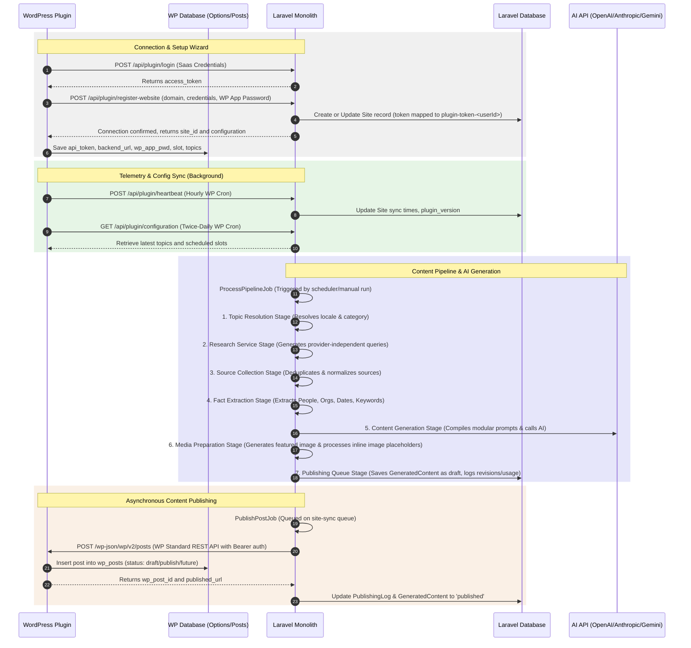

# REVERSE-ENGINEERED SYSTEM ARCHITECTURE

This document outlines the reverse-engineered system architecture of **NewsBlogify AI**, derived directly from the code implementation. It highlights the actual operational paths, data models, queue jobs, REST API flows, and critical design differences between the codebase and previous expectations.

---

## 1. End-to-End System Integration flows

NewsBlogify operates as a **Modular Monolith** in Laravel (backend) communicating via HTTP/REST with a custom WordPress client plugin installed on target sites.



### A. Authentication Flow
* **WordPress-to-Laravel Auth**: 
  - Standard Laravel user credentials are exchanged via POST `/api/plugin/login`.
  - Laravel returns a bearer token which is stored in the `keys` table with name pattern `plugin-token-{userId}`.
  - Subsequent requests to Laravel use `Bearer <token>` inside the `Authorization` header, validated using the `authenticateToken` helper.
* **Laravel-to-WordPress Auth**:
  - During setup, WordPress generates an **Application Password** (User Profile -> Application Passwords) which is sent to Laravel and stored in the `sites` database.
  - The WordPress plugin hooks into `determine_current_user` filter via `REST_Controller::authenticate_bearer_token()`. It intercepts requests containing the Bearer token or `api_key` param, compares them against the stored `wp_app_pwd` (SHA-256) or `api_token`, and returns the mapped `wp_user_id` to authenticate the API request as the administrator.

### B. Configuration Synchronization
* **Laravel-initiated Sync**:
  - Admin clicks "Sync Now" in Laravel or a `SyncSiteDataJob` runs on the queue.
  - Laravel calls WordPress custom endpoint `POST /wp-json/ai-news/v1/sync-data` containing selected topics and slots.
  - WordPress updates the local options table (`newsblogify_settings`).
* **WordPress-initiated Sync**:
  - WordPress Cron runs `newsblogify_sync_cron` twice daily, requesting `GET /api/plugin/configuration` from Laravel.
  - WordPress updates its local config parameters accordingly.

### C. Heartbeat & Telemetry
* WordPress cron `newsblogify_heartbeat_cron` executes hourly to call `POST /api/plugin/heartbeat`.
* Laravel updates the site's `last_synced_at` timestamp, `plugin_version`, and `last_sync_status` to maintain connection records.

### D. AI Content Generation
1. **Pipeline Execution**: `ProcessPipelineJob` loads the `PipelineRun` record and invokes `ContentGenerationService->generateContentForRun()`.
2. **Orchestration**: The generation runs through a modular pipeline using Laravel's native Pipeline/middleware pattern:
   - **Topic Resolution**: Resolves the topic's category, language, and maps locales/regions.
   - **Research Service**: Prepares search-oriented queries based on the topic. Keep the interface provider-independent.
   - **Source Collection**: Collects and normalizes sources, performing deduplication and metadata extraction.
   - **Fact Extraction**: Extracts People, Organizations, Locations, Dates, Events, and Keywords.
   - **Content Generation**: Compiles modular prompt blocks (System Prompt, Research Context, User Prompt, Variables, and Output Instructions) and calls the AI completion driver.
   - **Media Preparation**: Converts markdown to HTML, scans inline image placeholders, generates featured/inline images, and updates metadata.
   - **Publishing Queue**: Creates the `GeneratedContent` model with status `'draft'`, records revisions, and logs usage in `ai_request_logs` inside a DB transaction.
3. **Draft Enforcement**: Content is always queued with status `'draft'` and never published immediately to WordPress.

### E. Publishing Flow
1. **Queued Trigger**: When content is approved for publishing, `PublishPostJob` is dispatched.
2. **API Call**: `PublishingService` fetches dependencies and triggers `WPClientService::publishPost()`.
3. **WP Post Creation**: Calls WordPress standard REST API POST `/wp-json/wp/v2/posts`.
4. **Status Sync**: Laravel periodically runs `PublishingService::syncPostStatus()` via `GET /wp-json/wp/v2/posts/{id}`. If the post returns 404, Laravel falls back to marking the post failed and sets the local status back to `draft`.

---

## 2. Major Modules Breakdown

The Laravel backend is divided into 13 modules located in `app/Modules`.

```
Laravel Modules (app/Modules/)
├── SiteManager              # Tracks WordPress domains, API keys, and connection health
├── ContentPipeline          # Orchestrates triggers and queues for generation runs
├── ContentGeneration        # Handles prompt parsing and registers AI completions
├── AIProviderManager        # Integrates AI drivers (OpenAI, Anthropic, Gemini, etc.)
├── PromptManager            # Library for managing system and user templates
├── TopicManager             # Curates and schedules topic clusters
├── Publishing               # Manages WP standard REST publication queue
├── Licensing                # Dispatches plugin license activations
├── CustomerManager          # Tracks SaaS accounts
├── SubscriptionManager      # Manages user tiers and billing history
├── SystemSettings           # Global application settings
├── Operations               # Diagnostics, health metrics, and audit logs
└── AuthManager              # Users and Roles verification
```

### I. SiteManager
* **Purpose**: Manages remote WordPress instances, holds API keys/app passwords, and handles syncing.
* **Dependencies**: `CustomerManager`, `Publishing`.
* **API Endpoints Exposed**:
  - `POST /api/plugin/login` (login to SaaS)
  - `POST /api/plugin/register-website` (register WP domain url)
  - `GET /api/plugin/configuration` (fetch site config)
  - `GET /api/plugin/dashboard` (dashboard overview)
  - `GET /api/plugin/status` (status validation)
  - `POST /api/plugin/heartbeat` (cron heartbeat log)
  - `POST /api/plugin/sync` (sync trigger)
  - `POST /api/plugin/disconnect` (disconnect connection)
* **Database Interactions**: reads/writes `sites`, `keys`, and `users`.
* **Async Processes**: Runs `SyncSiteDataJob` which makes HTTP requests to WordPress `/wp-json/ai-news/v1/sync-data`.

### II. ContentPipeline
* **Purpose**: Combines site configuration, topic clusters, prompts, and providers into an execution flow.
* **Dependencies**: `SiteManager`, `TopicManager`, `PromptManager`, `AIProviderManager`, `ContentGeneration`.
* **APIs Exposed**: `/api/v1/pipelines` (CRUD).
* **Database Interactions**: `content_pipelines`, `pipeline_runs`.
* **Async Processes**: Dispatches `ProcessPipelineJob` when a pipeline is executed.

### III. ContentGeneration
* **Purpose**: Uses prompt templates and AI drivers to write articles and logs the resulting token usage.
* **Dependencies**: `AIProviderManager`, `PromptManager`, `TopicManager`, `ContentPipeline`.
* **APIs Exposed**: `/api/v1/articles`, `/api/v1/ai/logs`.
* **Database Interactions**: `generated_contents`, `content_revisions`, `ai_request_logs`.
* **Flow**: Invoked synchronously from `ProcessPipelineJob` to request completions, then stores initial drafts.

### IV. AIProviderManager
* **Purpose**: Decrypts provider credentials and loads driver clients (OpenAI, Anthropic, Google Gemini, Groq, Ollama, OpenRouter).
* **Dependencies**: None.
* **APIs Exposed**: `/api/v1/providers` (CRUD).
* **Database Interactions**: `ai_providers`.

### V. Publishing
* **Purpose**: Handles standard WordPress REST API publishing queues, retry policies, and status tracking.
* **Dependencies**: `SiteManager`, `ContentGeneration`.
* **APIs Exposed**: `/api/v1/publishing/logs`, `POST /api/v1/articles/{id}/publish` (manual publish).
* **Database Interactions**: `publishing_logs`, `generated_contents`.
* **Async Processes**: `PublishPostJob` runs on the default queue, utilizing `WPClientService` for WordPress connection.

### VI. Licensing
* **Purpose**: Validates, activates, and deactivates client plugin license keys.
* **Dependencies**: `CustomerManager`.
* **APIs Exposed**:
  - `POST /api/v1/license/verify`
  - `POST /api/v1/license/activate`
  - `POST /api/v1/license/deactivate`
* **Database Interactions**: `plugin_licenses`.
* **Current Status / Discrepancy**: While the Laravel backend implements this license check module, **the WordPress plugin currently lacks any license check logic** and does not consume these endpoints during onboarding.

---

## 3. Detailed Sequence Diagrams & Failure Paths

### Feature A: Site Connection & Onboarding

```mermaid
autonumber
graph TD
    Start([Start Wizard Step 1]) --> Form1[User submits email, password & Backend URL]
    Form1 --> API1[POST /api/plugin/login]
    
    API1 --> CheckAuth{Credentials valid?}
    CheckAuth -- No --> FailAuth[Return 401 Unauthorized] --> ShowError1[Show Error on Wizard Step 1]
    CheckAuth -- Yes --> SaveToken[Save Token in Laravel 'keys' table]
    SaveToken --> ReturnToken[Return bearer token to WordPress]
    
    ReturnToken --> Step2[Proceed to Wizard Step 2]
    Step2 --> Form2[User submits username, App Password, and Site Name]
    Form2 --> LocalVal{Validate App Password locally?}
    LocalVal -- No --> ShowError2[Show Invalid App Password error]
    LocalVal -- Yes --> API2[POST /api/plugin/register-website]
    
    API2 --> SaveSite[Laravel creates/updates Site record]
    SaveSite --> ReturnConfig[Return site_id and configuration]
    ReturnConfig --> Complete[Wizard completed, save connection state]
```

### Feature B: Content Publishing Lifecycle & Failure Paths

```mermaid
autonumber
graph TD
    Start[Approved Generated Content] --> Queue[QueuePublish called]
    Queue --> DuplicateCheck{Duplicate post in queue/completed?}
    DuplicateCheck -- Yes --> Reject[Throw Exception: Already published]
    DuplicateCheck -- No --> DbTx[Create PublishingLog 'pending' inside DB Transaction]
    
    DbTx --> DispatchJob[Dispatch PublishPostJob]
    DispatchJob --> HandleJob[Job Handler starts]
    HandleJob --> CancelCheck{Is job cancelled?}
    CancelCheck -- Yes --> AbortJob[Abort execution]
    CancelCheck -- No --> SetProcessing[Update PublishingLog status to 'processing']
    
    SetProcessing --> WPCall[Call WP POST /wp-json/wp/v2/posts]
    WPCall --> WPApiResp{WordPress API response?}
    
    WPApiResp -- Success (201) --> CompleteLog[Update PublishingLog status 'completed', update WP post ID & URL]
    CompleteLog --> UpdateArticle[Update GeneratedContent status to 'published']
    
    WPApiResp -- Failed / Timeout --> CatchErr[Catch Exception]
    CatchErr --> RetryCheck{Attempts < max tries 3?}
    RetryCheck -- Yes --> RetryJob[Set status 'retrying' and release job back to queue with delay]
    RetryCheck -- No --> FailJob[Set status 'failed', record error log, and reset GeneratedContent to 'draft']
```

---

## 4. Phase 3: Intelligent Content Generation Services

Phase 3 introduces advanced, provider-independent services integrated sequentially into the content pipeline:

### A. Source Intelligence
* **Class**: `SourceCollectionService` (implements `SourceCollectorInterface`)
* **Responsibilities**: Normalizes and deduplicates source URLs, calculates relevance scores dynamically using keyword density matching, detects regions/locales based on TLDs, and performs topic clustering on similar keywords.

### B. Fact Audit Service
* **Class**: `FactAuditService` (implements `FactAuditorInterface`)
* **Responsibilities**: Programmatically extracts factual claims from generated content, verifies them against research sources, classifies claims as supported/unsupported, calculates confidence and fact scores dynamically, and generates references.

### C. SEO Service
* **Class**: `SEOService` (implements `SEOServiceInterface`)
* **Responsibilities**: Generates meta descriptions, focus keywords, slugs, internal link suggestions, Open Graph and Twitter Card tags, and JSON-LD schema objects. Mapped structure is compatible with standard WordPress plugins (Yoast/RankMath).

### D. Localization (Translation) Service
* **Class**: `TranslationService` (implements `TranslationInterface`)
* **Responsibilities**: Translation pipeline supporting Hindi and English. If the target language differs from the canonical language, translates article content/title while backing up original canonical copies in metadata.

### E. Prompt Engine
* **Class**: `PromptEngine`
* **Responsibilities**: Modular prompt compiler that decouples prompt section construction (System persona, Research sources context, Facts factsheets, user prompt template interpolation, dynamic guidelines, and output constraints).

### F. Advanced WordPress Publishing
* **Class**: `WPClientService` (Laravel) & `REST_Controller` (WordPress Plugin)
* **API Route**: `POST /wp-json/newsblogify/v1/publish`
* **Responsibilities**: Accepts full category lists, tags, slugs, Yoast/RankMath SEO meta values, and a featured image URL. Sideloads featured images from the URL directly into WordPress media attachments and binds them as post thumbnails. Enforces idempotency via `publishing_log_id` checks.

---

## 5. Key Implementation Discrepancies

1. **Licensing Module Separation**: The Laravel backend defines a robust `Licensing` module to verify activations, domains, and expiration dates. However, the WordPress plugin codebase does not refer to license activation, validation, or validation endpoints, bypassing licensing restrictions altogether.
2. **Promt Model Spelling**: The Laravel prompt template module uses a database table named `promts` and a model named `Promt` (missing the 'o' character), which must be handled carefully during query constructions to avoid class-not-found errors.
3. **SSL Verification Exemption**: `API_Client::should_verify_ssl()` automatically disables SSL checking when calling hosts matching `127.0.0.1`, `localhost`, or domains ending with `.local`. This allows development configurations to operate on unencrypted channels without errors.