# SAAS ARCHITECTURE SPECIFICATION: NEWSBLOGIFY AI

This specification details the production-scale architecture of the **NewsBlogify AI** platform, reverse-engineered directly from the codebase. It traces structural components, dependencies, interfaces, schemas, state transitions, security, and deployments.

---

## 1. High-Level Component Architecture

NewsBlogify AI is structured around a **Modular Monolith** backend built on Laravel 11, communicating asynchronously with a client-side **WordPress Plugin** installed on user-owned blogs.

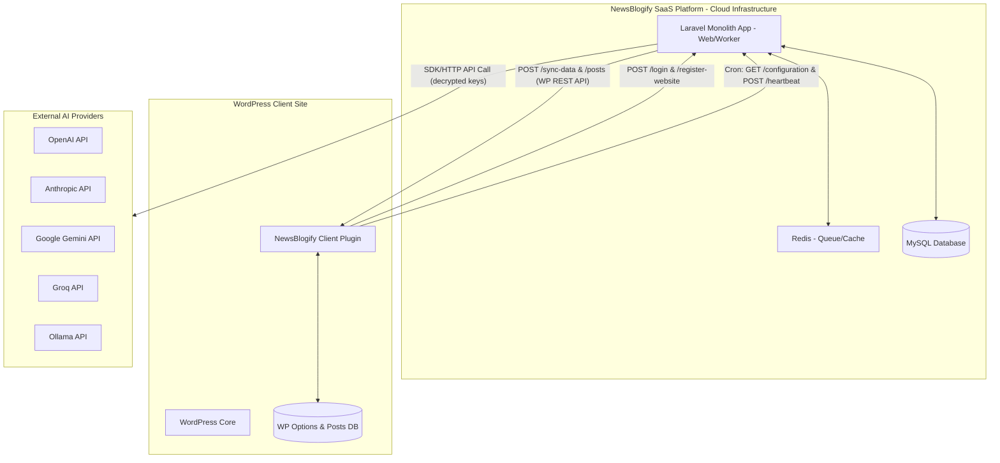

---

## 2. Laravel Module Dependency Graph

The Laravel backend separates logic into modules inside `app/Modules/`. Each module is encapsulated with its own Controllers, Models, Services, Requests, and Jobs.

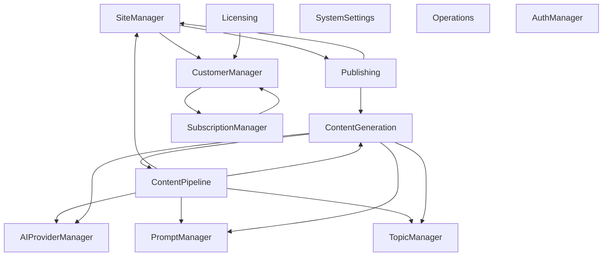

* **Integration Boundary Modules** (`SiteManager`, `Publishing`): Manage communication with remote WordPress endpoints.
* **Orchestration Layer Modules** (`ContentPipeline`, `ContentGeneration`): Execute multi-step operations (generation, compilation, parsing).
* **Library Modules** (`AIProviderManager`, `PromptManager`, `TopicManager`): Hold static definitions, encryption keys, and schema templates.
* **Core SaaS Modules** (`AuthManager`, `CustomerManager`, `SubscriptionManager`, `Licensing`): Handle tenant lifecycle, billing, and system states.

---

## 3. WordPress Plugin Internal Architecture

The plugin is structured in a procedural-to-object-oriented wrapper system to run securely on WordPress.

```
WordPress Plugin File Hierarchy
├── newsblogify-client.php          # Main entry bootstrap, hooks activation/deactivation
└── includes/
    ├── class-newsblogify-config.php  # Handles serialized option storage (newsblogify_settings)
    ├── class-newsblogify-logger.php  # Formats logs and handles secure .htaccess generation
    ├── class-newsblogify-api-client.php # Outgoing client wrapper using wp_remote_request
    ├── class-newsblogify-rest-controller.php # Registers REST endpoints and hooks Auth Interceptor
    └── class-newsblogify-cron.php    # Registers and processes hourly/daily scheduled cron hooks
```

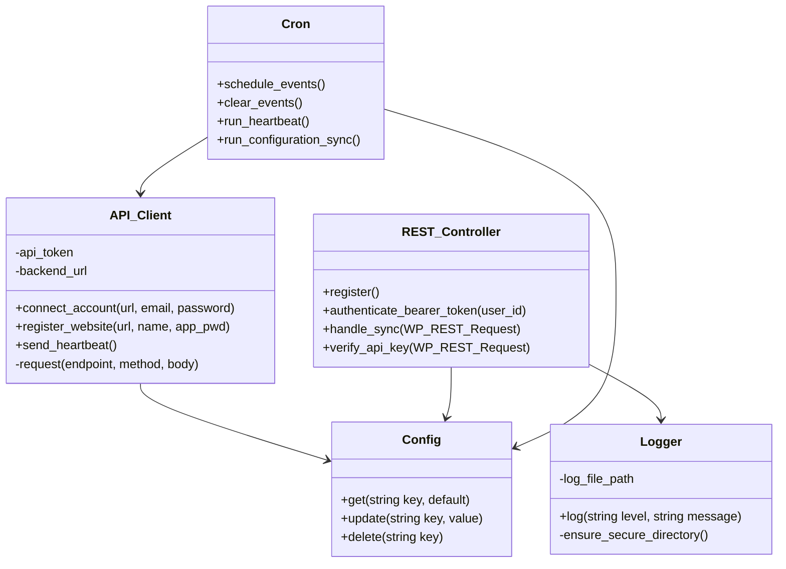

---

## 4. Database ER Diagram

The database models leverage strict foreign key relations to map users, websites, AI logs, configurations, and licenses.

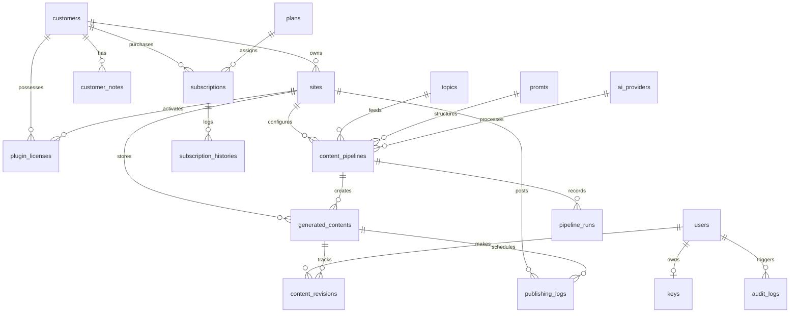

### Table Schema Definition Specifications

| Table | Primary Key | Foreign Key Columns | Description |
| :--- | :--- | :--- | :--- |
| **`users`** | `id` | - | SaaS operators, users, and administrators. |
| **`keys`** | `id` | - | Personal access tokens (named `plugin-token-{userId}`). |
| **`sites`** | `id` | `customer_id` | Remote WordPress website connections (API Key is encrypted). |
| **`topics`** | `id` | - | Scheduled categories and post concepts. |
| **`promts`** | `id` | - | Prompts template table (spelled **`promts`** with **`promt`** template column). |
| **`ai_providers`** | `id` | - | Decryption drivers for OpenAI, Anthropic, Gemini, Groq, etc. |
| **`content_pipelines`** | `id` | `site_id`, `topic_id`, `prompt_id`, `ai_provider_id` | Mapping configuration linking prompt templates to websites. |
| **`pipeline_runs`** | `id` | `pipeline_id` | Historical queue execution times and status runs. |
| **`generated_contents`** | `id` | `pipeline_id`, `site_id`, `topic_id` | AI output drafts and token metrics. |
| **`content_revisions`** | `id` | `generated_content_id`, `user_id` (nullable) | Version edit history tracking. |
| **`ai_request_logs`** | `id` | - | Detailed token tracking and cost auditing per API call. |
| **`publishing_logs`** | `id` | `generated_content_id`, `site_id`, `user_id` | Core WordPress REST publish queue results. |
| **`customers`** | `id` | - | Tenant accounts billing representation. |
| **`plugin_licenses`** | `id` | `customer_id`, `site_id` | Licensing activations (Inactive/Active/Expired/Revoked). |
| **`subscriptions`** | `id` | `customer_id`, `plan_id` | Subscription mapping per tier. |

---

## 5. API Contract Documentation

### A. WordPress Endpoints (Exposed by WP Plugin)

#### **1. Sync Data Settings**
* **Method & Path**: `POST /wp-json/ai-news/v1/sync-data`
* **Headers**: `Authorization: Bearer <wp_app_pwd>`
* **Request Schema**:
  ```json
  {
    "selected_topics": ["Tech", "SaaS", "AI"],
    "slot": "Daily",
    "api_key": "wp_app_password"
  }
  ```
* **Response (200 OK)**:
  ```json
  {
    "status": "success",
    "message": "WordPress settings sync completed successfully."
  }
  ```

#### **2. WordPress Core Post Creation**
* **Method & Path**: `POST /wp-json/wp/v2/posts/{wp_post_id?}`
* **Headers**: `Authorization: Bearer <wp_app_pwd>`
* **Request Schema**:
  ```json
  {
    "title": "Decentralized AI in 2026",
    "content": "Full article markup...",
    "status": "publish",
    "categories": [2],
    "date": "2026-07-05 03:00:00"
  }
  ```
* **Response (201 Created)**:
  ```json
  {
    "id": 1024,
    "link": "https://clientblog.com/decentralized-ai-2026/",
    "status": "publish"
  }
  ```

---

### B. Laravel Backend Endpoints (Exposed to WP Plugin)

#### **1. Account Login**
* **Method & Path**: `POST /api/plugin/login`
* **Request Schema**:
  ```json
  {
    "email": "saas_user@gmail.com",
    "password": "password"
  }
  ```
* **Response (200 OK)**:
  ```json
  {
    "status": "success",
    "access_token": "random_60_char_token_string",
    "user": { "id": 1, "name": "Manager User" }
  }
  ```

#### **2. Site Registration**
* **Method & Path**: `POST /api/plugin/register-website`
* **Headers**: `Authorization: Bearer <access_token>`
* **Request Schema**:
  ```json
  {
    "domain_url": "https://clientblog.com",
    "name": "My Blog",
    "api_key": "xxxx xxxx xxxx xxxx",
    "slot": "Daily"
  }
  ```
* **Response (200 OK)**:
  ```json
  {
    "status": "success",
    "site_id": 3,
    "configuration": { "slot": "Daily", "selected_topics": [] }
  }
  ```

---

### C. Workspace & Employee Endpoints (Enterprise API)

#### **1. List Workspaces**
* **Method & Path**: `GET /api/v1/workspaces`
* **Headers**: `Authorization: Bearer <access_token>`
* **Parameters**: `customer_id` (optional, SuperAdmin only), `limit` (optional, default 15)
* **Response (200 OK)**:
  ```json
  {
    "data": [
      {
        "id": 1,
        "name": "Production Workspace",
        "customer_id": "uuid-string-here",
        "sites": [],
        "employees": [],
        "created_at": "2026-07-09T03:00:00.000000Z",
        "updated_at": "2026-07-09T03:00:00.000000Z"
      }
    ],
    "links": {},
    "meta": {}
  }
  ```

#### **2. Create Workspace**
* **Method & Path**: `POST /api/v1/workspaces`
* **Headers**: `Authorization: Bearer <access_token>`
* **Request Schema**:
  ```json
  {
    "name": "New Team Workspace",
    "customer_id": "uuid-string-here"
  }
  ```
* **Response (201 Created)**:
  ```json
  {
    "data": {
      "id": 2,
      "name": "New Team Workspace",
      "customer_id": "uuid-string-here",
      "sites": [],
      "employees": [
        {
          "id": 5,
          "workspace_id": 2,
          "user_id": 12,
          "role": "Owner"
        }
      ]
    }
  }
  ```

#### **3. List Workspace Employees**
* **Method & Path**: `GET /api/v1/workspaces/{id}/employees`
* **Headers**: `Authorization: Bearer <access_token>`
* **Response (200 OK)**:
  ```json
  {
    "data": [
      {
        "id": 5,
        "workspace_id": 2,
        "user_id": 12,
        "role": "Owner",
        "user": {
          "id": 12,
          "name": "Jane Doe",
          "email": "jane@company.com"
        }
      }
    ]
  }
  ```

#### **4. Add Workspace Employee**
* **Method & Path**: `POST /api/v1/workspaces/{id}/employees`
* **Headers**: `Authorization: Bearer <access_token>`
* **Request Schema**:
  ```json
  {
    "user_id": 15,
    "role": "Editor"
  }
  ```
* **Response (201 Created)**:
  ```json
  {
    "data": {
      "id": 6,
      "workspace_id": 2,
      "user_id": 15,
      "role": "Editor"
    }
  }
  ```

#### **5. Update Employee Role**
* **Method & Path**: `PUT /api/v1/workspaces/{id}/employees/{employeeId}`
* **Headers**: `Authorization: Bearer <access_token>`
* **Request Schema**:
  ```json
  {
    "role": "Admin"
  }
  ```
* **Response (200 OK)**:
  ```json
  {
    "data": {
      "id": 6,
      "workspace_id": 2,
      "user_id": 15,
      "role": "Admin"
    }
  }
  ```

#### **6. Remove Employee**
* **Method & Path**: `DELETE /api/v1/workspaces/{id}/employees/{employeeId}`
* **Headers**: `Authorization: Bearer <access_token>`
* **Response (200 OK)**:
  ```json
  {
    "message": "Employee removed from workspace."
  }
  ```

---

## 6. Queue & Job Lifecycle Diagram

The queue structure handles heavy processing tasks (AI completions, HTTP publication) outside of the HTTP request lifecycle.

```mermaid
stateDiagram-v2
    [*] --> Dispatched : Job dispatched to Queue
    
    state Dispatched {
        [*] --> Queue_Log : AppServiceProvider Queue::before Event
        Queue_Log --> Processing : Job Log set to 'processing'
    }
    
    Processing --> Running : Worker executes handle()
    
    state Running {
        [*] --> API_Request : Call External API (AI/WordPress)
        
        API_Request --> HTTP_Success : Response 200 OK / 201 Created
        HTTP_Success --> DB_Commit : Commit DB changes inside transaction
        
        API_Request --> HTTP_Fail : Request fails / Timeout
        HTTP_Fail --> Raise_Exception : Exception thrown
    }
    
    DB_Commit --> Completed : Job logs completed status
    Completed --> [*] : Job removed from Queue

    Raise_Exception --> Failed : AppServiceProvider Queue::failing Event
    
    state Failed {
        [*] --> Retry_Check : Attempts < tries (3)?
        Retry_Check --> Requeued : Yes (Release job with backoff delay)
        Retry_Check --> Maxed_Out : No (Mark Job failed)
    }
    
    Requeued --> Dispatched : Return to Queue
    Maxed_Out --> Reset_Draft : Reset local model state to 'draft'
    Reset_Draft --> [*]
```

---

## 7. Authentication & Security Architecture

```mermaid
graph LD
    subgraph WP_Security[WordPress Security Layers]
        Auth_Filter[determine_current_user filter hook]
        Hash_Verify[hash_equals verification]
        Log_Lock[Secure Log Directory]
        Htaccess[Deny from all .htaccess]
    end

    subgraph Laravel_Security[Laravel Security Layers]
        Key_Decryption[Eloquent Key Decrypt casts]
        Bearer_Lookup[keys table lookup]
        App_Key[Laravel APP_KEY Encryption]
    end

    %% Operations
    Auth_Filter --> Hash_Verify
    Log_Lock --> Htaccess
    Key_Decryption --> App_Key
```

* **Encryption-at-Rest**: SaaS credentials (WordPress Application Passwords and AI API tokens) are encrypted in the database using Laravel's native encrypter. Models like `Site` and `AIProvider` enforce the `casts` system:
  ```php
  'api_key' => 'encrypted'
  ```
  This encrypts values before database insertion (AES-256-CBC) using the environment's `APP_KEY`.
* **WP Log Protection**: The WordPress plugin restricts access to logs by writing an `.htaccess` block on directory creation:
  ```apache
  Order deny,allow
  Deny from all
  ```
  An empty `index.php` is placed inside the directory to prevent folder index list lookups.

---

## 8. Content Pipeline Architecture

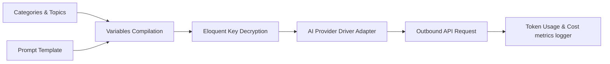

1. **Category Feed**: Topics and languages are fed into `ContentGenerationService`.
2. **Context Compilation**: Placeholders (`{{topic}}`, `{{category}}`, `{{language}}`, `{{website}}`) are compiled inside the template field `promt` (from the `promts` database table).
3. **Decryption**: Active AI Provider access tokens are decrypted.
4. **Adapter Factory**: Maps keys (`openai`, `anthropic`, etc.) to custom API drivers.
5. **Metrics Logging**: Logs latency, counts prompt/completion/total tokens, translates them into USD billing costs, and updates `ai_request_logs`.

---

## 9. State Machines

### A. ContentPipeline
Maps automated trigger configurations.

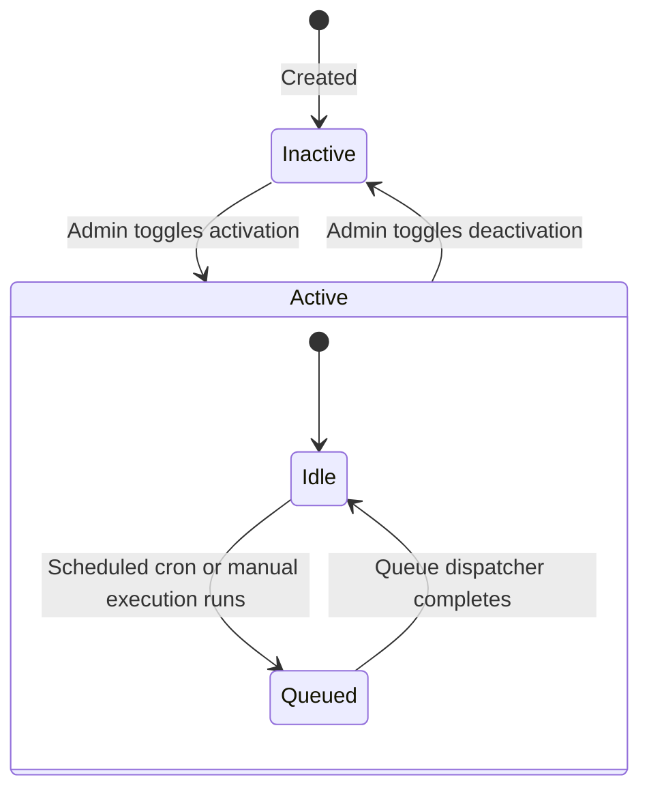

### B. PipelineRun
Logs lifecycle of each background queue generation step.

| Current State | Event | Target State | DB Column Action |
| :--- | :--- | :--- | :--- |
| **`queued`** | Queue Job Starts | **`processing`** | Sets `started_at = now()`, `status = 'processing'` |
| **`processing`** | AI Response Success | **`completed`** | Sets `completed_at = now()`, `status = 'completed'` |
| **`processing`** | API Error / Timeout | **`failed`** | Increments `retry_count`, logs `error_message`, status set to `'failed'` |
| **`failed`** | Manual Retry | **`queued`** | Resets `error_message`, sets `status = 'queued'` |

### C. GeneratedContent
Represents the status lifecycle of generated articles.

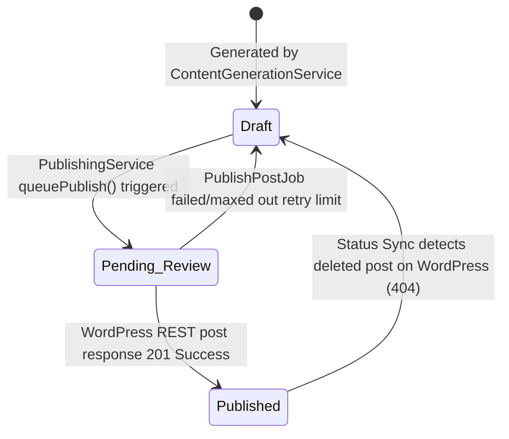

---

## 10. Failure Recovery & Retry Architecture

### A. HTTP Failures & Timeouts
* **Issue**: Slow remote WP responses or connection drops.
* **Resolution**: Laravel's `WPClientService` executes HTTP requests with a `200` second timeout, protecting worker processes from hanging.

### B. Queue Retries and Job Release
* **Strategy**: `PublishPostJob` has a maximum limit of **3 attempts** with a **60 second backoff delay**.
* **Path**:
  - `PublishPostJob` catches exceptions during execution.
  - If attempt count is $< 3$, status is set to `'retrying'`, the current attempt number is saved in `retry_count`, and the job is released back to the queue: `$this->release($this->backoff)`.
  - If attempts $\ge 3$, status changes to `'failed'`, the error log is saved in `publishing_logs`, and the content status transitions back to `'draft'` to allow manual corrections.

### C. Orphaned Post Validation (Status Sync)
* **Issue**: A post is deleted or unpublished directly in WordPress by a user, causing Laravel records to become out of sync.
* **Resolution**: Laravel checks post existence via `GET /wp-json/wp/v2/posts/{wp_post_id}`. If the REST API returns HTTP `404 Not Found`, the backend marks the local publication log as `'failed'` (setting the error message to `"Post was deleted or unpublished from WordPress"`) and resets the article status back to `'draft'` to allow republishing.

---

## 11. Deployment Architecture

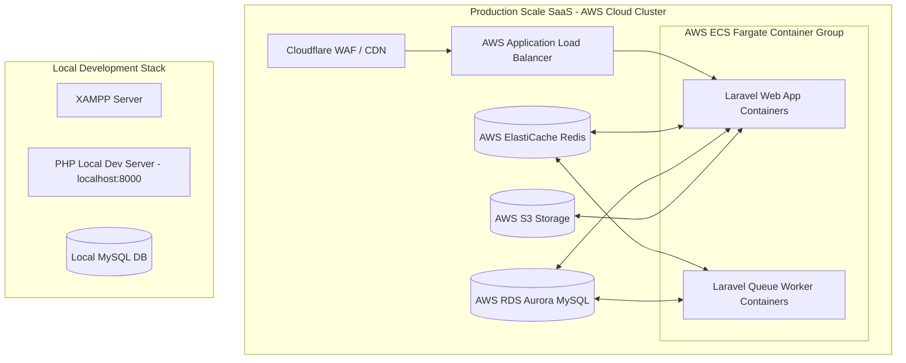

* **Production Stack**:
  - **Reverse Proxy**: Cloudflare handles SSL offloading, DDoS protection, and routes queries.
  - **Compute Containers**: AWS ECS Fargate runs isolated containers for the Laravel web server and queue workers.
  - **Shared Storage**: AWS S3 acts as a filesystem to store generated media files.
  - **Cache & Queue Database**: AWS ElastiCache Redis stores sessions, handles cache keys, and drives queue operations.
  - **SQL Database**: Aurora MySQL Multi-AZ handles transaction schemas.

---

## 12. Configuration Flow

Configurations are synchronized via push and pull actions to keep both databases in sync.

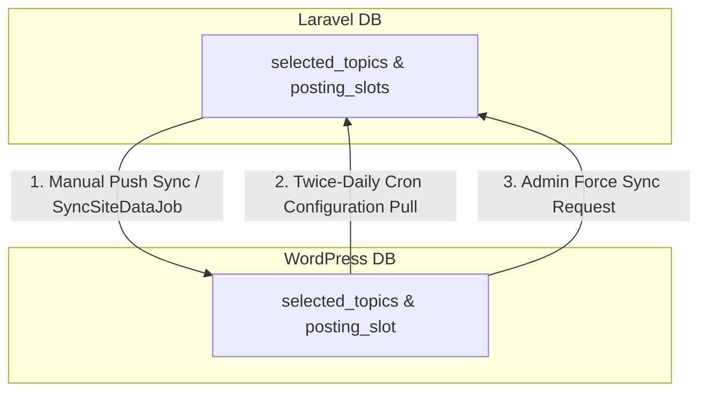

1. **Manual Push Sync**: Changes made to settings in the Laravel dashboard are pushed to the WordPress plugin database using `SyncSiteDataJob`.
2. **Cron Pull Sync**: The WordPress plugin's recurring cron job queries Laravel twice daily to pull the latest configuration settings.
3. **WordPress Manual Sync**: An administrator forces a sync from the WordPress admin interface, pulling settings directly from the Laravel backend.

---

## 13. Sequence Diagrams for Core Features

### A. Setup Wizard Onboarding Sequence

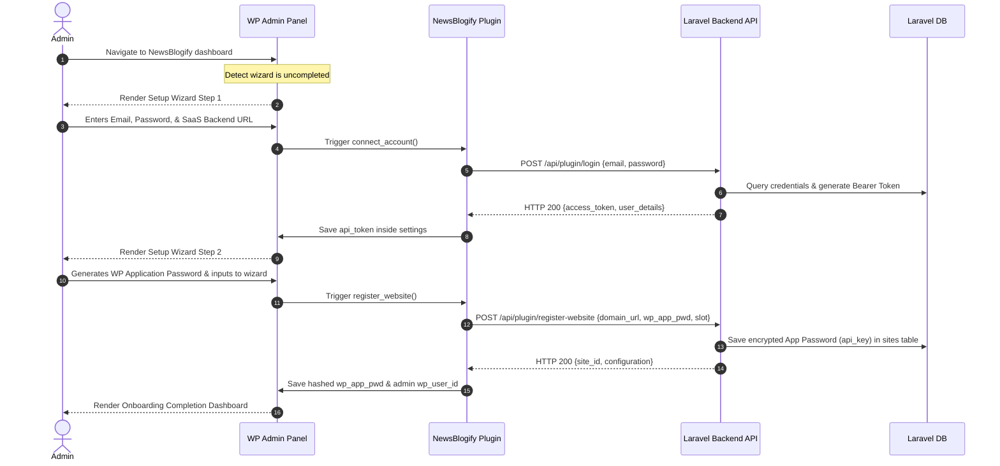

### B. Configuration Synchronization Sequence

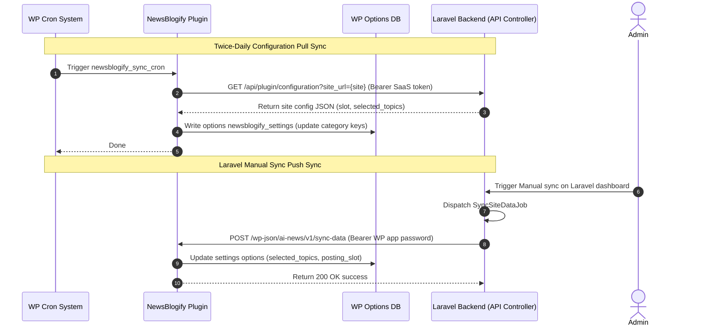

### C. Periodic Heartbeat Sync Sequence

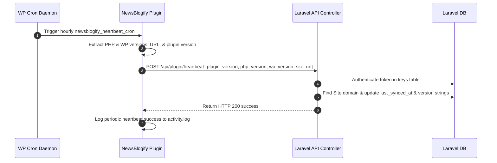

### D. AI Generation Run Sequence

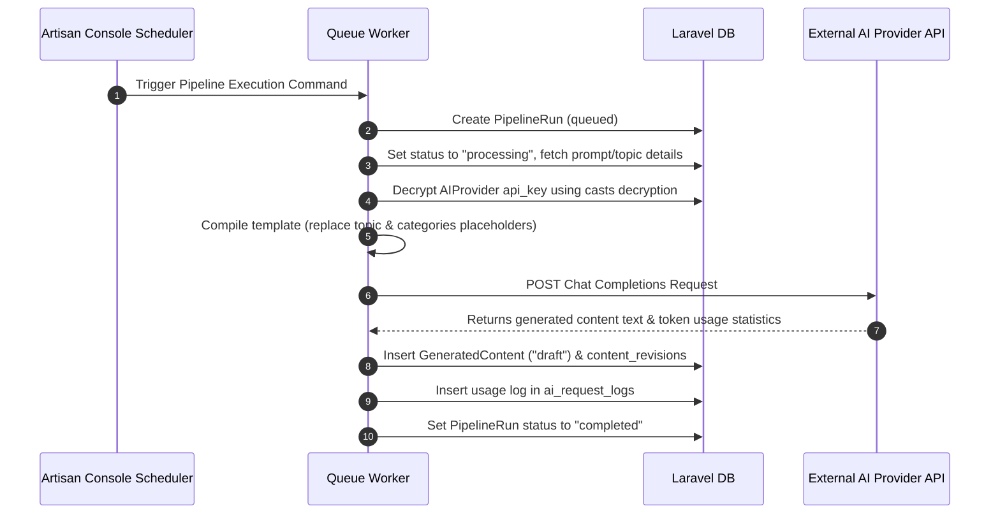

### E. Article Publishing Sequence

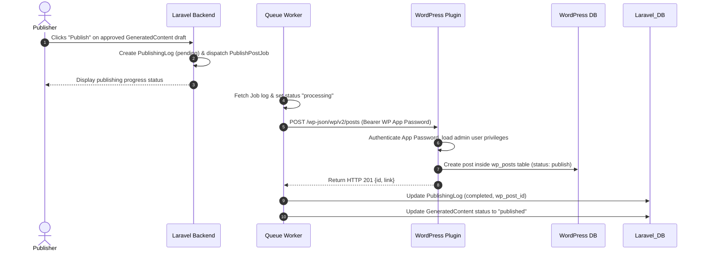

---

## 14. C4 Model (Context, Container, Component, Code)

### Level 1: System Context Diagram
Shows the high-level boundaries of the system and how users interact with it.

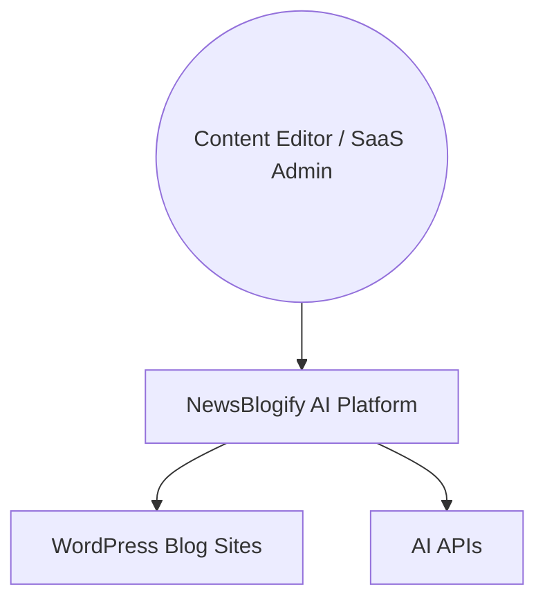

---

### Level 2: Container Diagram
Details the architectural containers (SaaS Web App, Queue Workers, Databases, and the WP plugin).

```mermaid
graph TB
    actor Admin[SaaS Editor / Admin]
    
    subgraph SaaS_Containers[SaaS Platform Containers]
        Web_App[Laravel Web App - PHP/Nginx]
        Queue_Worker[Laravel Queue Workers]
        Redis[Redis Cache / Queue]
        MySQL[(MySQL Database)]
    end

    subgraph Client_Containers[WordPress Containers]
        WP_App[WordPress Instance - Apache/PHP]
        WP_DB[(WordPress Options/Posts DB)]
    end

    subgraph External_Containers[External APIs]
        AI_APIs[AI Providers - OpenAI / Anthropic / Google]
    end

    %% Interactions
    Admin --> Web_App
    
    Web_App <--> Redis
    Queue_Worker <--> Redis
    
    Web_App <--> MySQL
    Queue_Worker <--> MySQL
    
    Web_App -- "1. Connection handshakes & syncs" --> WP_App
    Queue_Worker -- "2. Publications / Sync-Data POSTs" --> WP_App
    WP_App -- "3. Heartbeat crons & configurations" --> Web_App

    WP_App <--> WP_DB
    
    Queue_Worker -- "4. AI generation calls" --> AI_APIs
```

---

### Level 3: Component Diagram (Focus: Core Integration Modules)
Breaks down the components inside the Laravel Container that handle communication with WordPress.

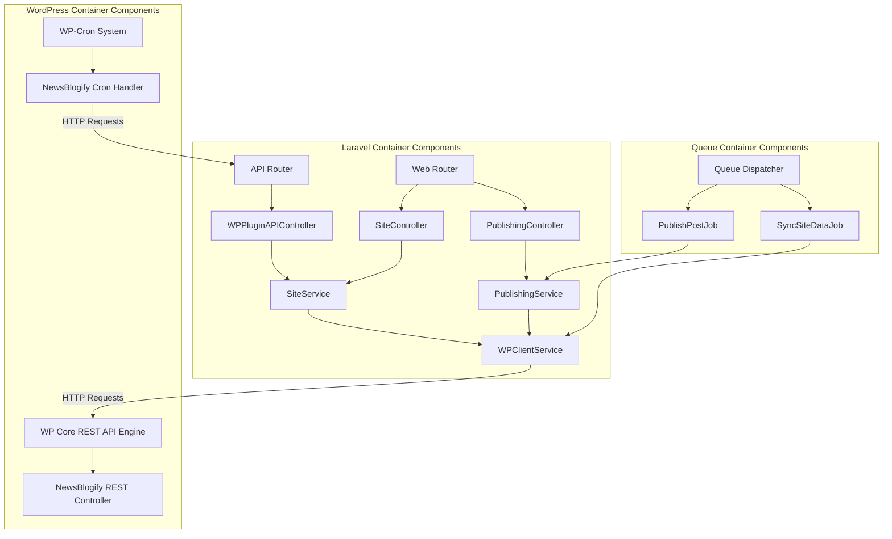

---

### Level 4: Code Diagram (Focus: Site Connections & REST Verification)
Maps the exact class-level relationships and call methods that handle authentication and sync actions.

```mermaid
classDiagram
    class WPPluginAPIController {
        +login(Request) JsonResponse
        +registerWebsite(Request) JsonResponse
        +heartbeat(Request) JsonResponse
        +configuration(Request) JsonResponse
        -authenticateToken(Request) User
    }

    class WPClientService {
        +validateConnection(Site) bool
        +sync(Site) bool
        +publishPost(Site, title, content, status, scheduled_at, wp_post_id) array
        -resolveApiKey(Site) string
    }

    class NewsBlogify_REST_Controller {
        +register() void
        +authenticate_bearer_token(user_id) int
        +handle_sync(WP_REST_Request) WP_REST_Response
        -verify_api_key(WP_REST_Request) bool
    }

    class NewsBlogify_API_Client {
        +connect_account(url, email, password) array
        +register_website(url, name, app_pwd) array
        +send_heartbeat() array
        -request(endpoint, method, payload) array
    }

    WPPluginAPIController --> WPClientService : "calls sync"
    NewsBlogify_API_Client -- "POST /login & /register-website" --> WPPluginAPIController
    WPClientService -- "POST /sync-data & /posts" --> NewsBlogify_REST_Controller
```
